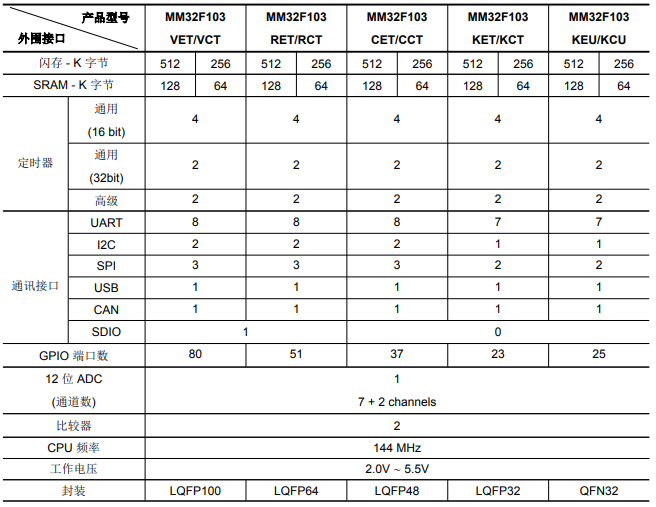

# [MM32F103](https://github.com/SoCXin/MM32F103)

#### [Vendor](https://github.com/SoCXin/Vendor)：[MindMotion](http://www.mm32.com.cn/)
#### [Core](https://github.com/SoCXin/Cortex)：[Cortex M3](https://github.com/SoCXin/CM3)
#### [Level](https://github.com/SoCXin/Level)：144MHz

## [描述](https://github.com/SoCXin/MM32F103/wiki)

[MM32F103](https://github.com/SoCXin/MM32F103) 本产品包含 1个 12 位的 ADC、2 个比较器、2 个 16 位通用定时器、2 个 32 位通用定时器、2 个 16 位基本定时器、2 个 16 位高级定时器。

主要特点包括大量的通信接口：

* USBOTG 接口+ CAN接口
* SDIO 接口
* 7-8 个UART接口

### [资源收录](https://github.com/SoCXin/MM32F103)

* [文档](docs/)
* [资源](src/)
* [工程](project/)

### [选型建议](https://github.com/SoCXin)

[MM32F103](https://github.com/SoCXin/MM32F103) 对比[STM32F103](https://github.com/SoCXin/STM32F103) 具有2倍的主频和更高规格的存储空间，兼容宽电压供电，缺点是开发资源不够，软件的开发成本较高。

###  [SoC芯平台](http://www.SoC.Xin)
